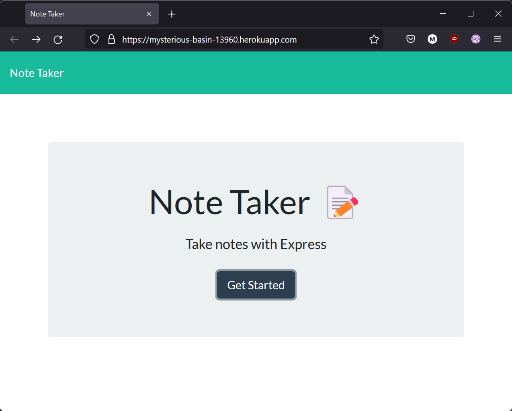
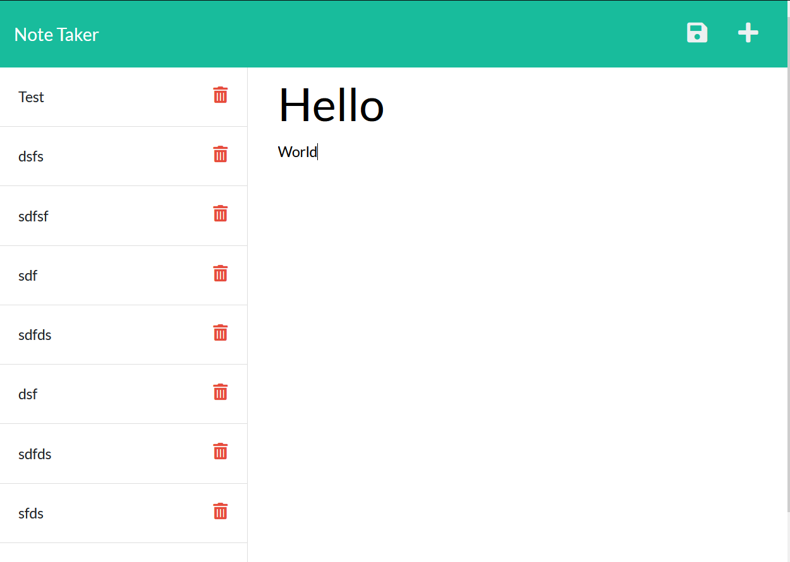

# Note-Taker
[](https://opensource.org/licenses/BSD-3-Clause)

## Description

The motiviation behind this project was to create a webpage that would 


## Table of Contents

- [Installation](#installation)
- [Usage](#usage)
- [Credits](#credits)
- [License](#license)

## Installation

Go to github, and git clone this project. Run npm i in the command line to download necessary files. Run npm i to start. You could also just go to the deployed page at: https://tranquil-chamber-13396.herokuapp.com/ .

## Usage




## Credits

Chris Muto: https://github.com/chrismuto/ 
<br>
David Luu: https://github.com/MaestroLuu


```
node.js
vscode
github
```

## License

BSD3

---

## Features

The project opens up a webpage where you can save notes with a title and text inside the notes, then inputs it on the left column where you can click on it and see the note posted.

## How to Contribute

This project is not open to contributions from third parties.

## Tests



## Creator Information

https://github.com/JaggedComet

MarcoFlores1029@gmail.com